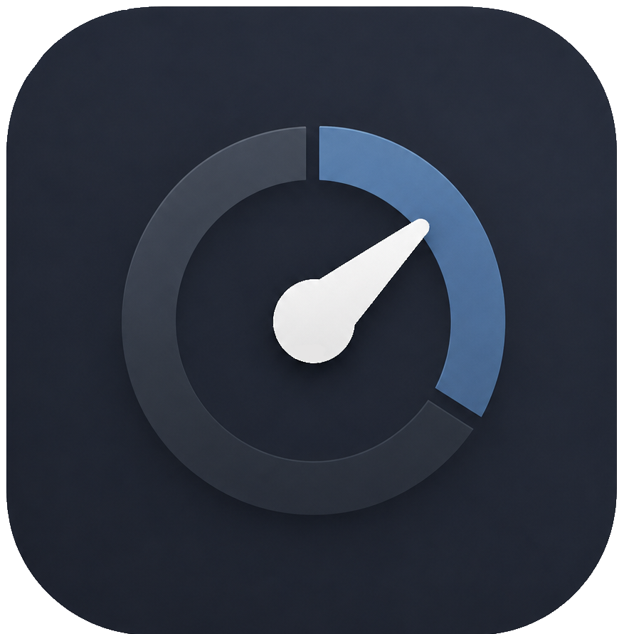

# Counter-App

[](https://github.com/AlphexOne/Counter-App/issues)
[](https://alphexone.github.io/Counter-App/)
[](https://github.com/AlphexOne/Counter-App/releases)
[](https://github.com/AlphexOne/Counter-App/releases)

---

<p align="center">
  
</p>

---

# 📱 Counter-App (iOS-Style Web App)

Eine elegante, minimalistische und voll funktionsfähige Zähler-App im modernen iOS-Design (Dark Mode). 
Diese Web-App wurde speziell für die Nutzung auf Smartphones optimiert, bietet jedoch auch eine vollständig simulierte iPhone-Ansicht auf Desktop-Bildschirmen.

---

## ✨ Features

- **Dynamischer Counter-View:** Der Name des aktuell geöffneten Zählers wird direkt im fixierten Header angezeigt. 

- **Intelligentes Kontextmenü:** Über ein Drei-Punkte-Symbol (`...`) an jeder Kachel öffnet sich ein Kontextmenü zum bearbeiten.

- **Automatischer Täglicher Reset:** In den Einstellungen kann für jeden Counter individuell ein automatischer Reset um **00:00 Uhr Mitternacht** aktiviert werden. 

- **Interaktiver Info-Tooltip:** Ein elegantes CSS-Info-Icon (`i`) in den Einstellungen erklärt beim Drüberfahren (Hover/Touch) sofort die genaue Funktionsweise des täglichen Resets.

- **Echte Mobile-Optimierung:**
  - Nutzt moderne `100dvh`-Einheiten (Dynamic Viewport Height), um unschönes Scrollen des gesamten Smartphone-Browsers zu verhindern.
  - Vollständige Integration der **Safe Area** (iOS Home-Bar), sodass der Footer nahtlos mit der Unterkante des Displays abschließt.
  - Der Scrollbalken ist auf mobilen Geräten unsichtbar für einen extrem cleanen, nativen App-Look.

  - **Zoom-Schutz:** Schnelles, mehrfaches Tippen auf das Plus- oder Minus-Symbol führt nicht mehr zu einem ungewollten Browser-Zoom (*Double-Tap-to-Zoom* deaktiviert via `touch-action: manipulation`).

- **Persistente Speicherung:** Alle Zählerstände, Namen und Zeitstempel werden im `localStorage` deines Browsers gesichert. Beim nächsten Start öffnet die App automatisch den zuletzt genutzten Counter.


---


## 🛠️ Technologien

- **HTML5:** Semantische Strukturierung der Views.
- **CSS3:** Moderner Dark Mode (Apple-Core-Farbpalette), Custom-Scrollbars, flexibles Flexbox-Layout und reines CSS-Hover-Handling für Tooltips.
- **Vanilla JavaScript (ES6):** Dynamisches Rendering der Kacheln, LocalStorage-Anbindung, Datumsvergleiche für den Mitternachts-Reset und Positionsberechnungen für UI-Elemente.
- **FontAwesome:** Hochwertige Vektor-Icons für Navigation und Steuerung.


---


## 📂 Projektstruktur

```text
├── index.html       # Struktur der App (Main-View, Counter-View, Settings-View)
├── style.css        # Komplette UI-Stylings, iOS-Simulator & responsive Handy-Anpassungen
└── app.js           # App-Logik, Event-Handling, Reset-Funktionen & Speicherverwaltung

```


---


## 🚀 Installation & Start

Da die App vollständig in nativem Webcode geschrieben ist, benötigst du **keine Installation** oder Build-Tools.

1. Lade die drei Projektdateien (`index.html`, `style.css`, `app.js`) in denselben Ordner herunter.
2. Öffne die Datei `index.html` per Doppelklick in einem beliebigen modernen Webbrowser.
3. *Handy-Tipp:* Lade die Dateien auf einen Webserver hoch (oder nutze den VS Code Live Server), öffne sie auf dem Smartphone und wähle „Zum Home-Bildschirm hinzufügen“, um das Gefühl einer nativen App zu bekommen.


---


## ⚙️ Funktionsweise des täglichen Resets

Das System vergleicht beim Öffnen eines Counters den aktuellen Kalendertag mit dem gespeicherten Datum der letzten Aktualisierung (`updatedAt`). Sobald ein neuer Tag anbricht (**nach 00:00 Uhr Mitternacht**) und der Zähler das erste Mal aufgerufen wird, springt der Wert automatisch auf `0`. Die Prüfung erfolgt ressourcenschonend direkt im Browser.


---


## 📜 Lizenz

Copyright (C) 2026 AlphexOne

Dieses Projekt steht unter der GNU General Public License v3.0.

Weitere Informationen siehe `LICENSE` oder:
https://www.gnu.org/licenses/gpl-3.0.en.html

---
